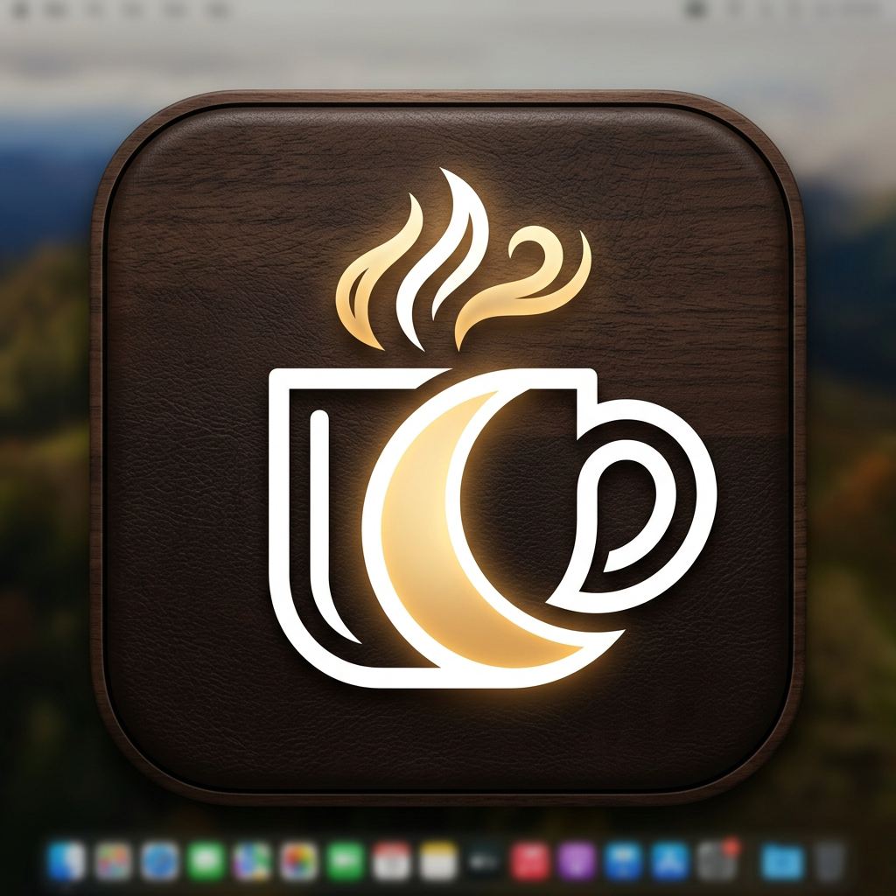
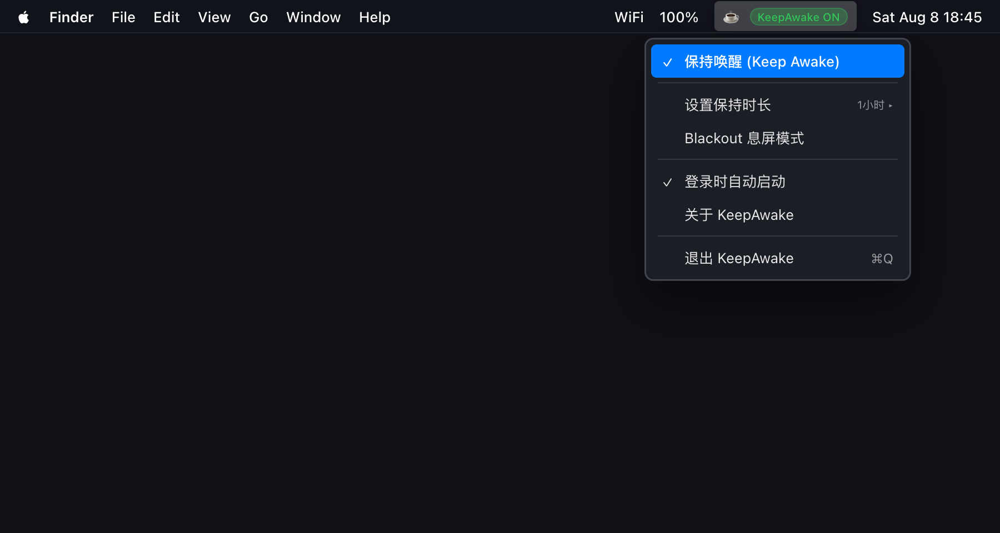

<p align="center">
  
</p>

<h1 align="center">KeepAwake</h1>

<p align="center">
  <strong>A native macOS menu bar utility that prevents system sleep while an Agent or background task is working.</strong>
</p>

<div align="center">
  <a href="https://KhalilHsu.github.io/CoffeeORTea/">🌐 Visit Website</a>
</div>

<br/>
KeepAwake is a native macOS menu bar utility. When enabled, it uses the system `caffeinate` command to prevent idle system and display sleep, with timed keep-awake options and Blackout Mode. It does not bypass manual locking, lid-closure behavior, or authentication.

<p align="center">
  
</p>

Blackout Mode normally reduces built-in and external display brightness to 0 instead of sending a display power-off command. This is intended to keep displays in the system graphics topology for background screenshots or automation, but behavior still depends on the actual display, connection path, and macOS version.

## Features

- Menu bar status for normal sleep and KeepAwake activity.
- Reads the effective power policy when launching and opening the menu; another program's `caffeinate` is not mistaken for KeepAwake's own state.
- Indefinite, 15-minute, 1-hour, 3-hour, and until-next-8:00-AM durations.
- Blackout Mode: DisplayServices for built-in displays, DDC/CI for external displays, and a Gamma fallback where available.
- A protected temporary recovery file plus an independent watchdog for best-effort restoration after an unexpected exit.
- Rapid mouse movement or three key presses in a short window can restore the displays.
- English and Simplified Chinese menus and notifications, following the macOS preferred language.
- macOS 13 or later; no third-party packages or Xcode project are required.

## Security, privacy, and data boundaries

- The app has no network requests, analytics SDK, remote-control path, or third-party runtime dependency.
- It starts and manages only its own `/usr/bin/caffeinate` process and does not terminate assertions owned by other programs.
- The temporary Blackout recovery file contains only the state needed to restore the current displays (display IDs, brightness, Gamma, and external-display IORegistry paths). The watchdog deletes it after recovery, and the file is restricted to the current user.
- The global keyboard monitor only counts whether three keys were pressed within a short window; it does not read, store, or upload key values. macOS may require authorization under System Settings → Privacy & Security → Input Monitoring/Accessibility. Mouse restoration may still work without it.
- Notification authorization is optional and does not affect KeepAwake itself.

## Requirements

- macOS 13 or later.
- Xcode Command Line Tools. Install them if needed:

  ```bash
  xcode-select --install
  ```

- External-display DDC control requires DDC/CI support. The result varies with the monitor, cable, dock, Apple Silicon hardware, and macOS version.

## Build and run from source

This repository currently documents a source build; it does not represent an unsigned local build as an official installer.

```bash
git clone https://github.com/KhalilHsu/CoffeeORTea.git
cd CoffeeORTea
./install.sh
```

`install.sh` will call `build.sh` to compile an arm64 + x86_64 universal binary, create the app bundle, apply an ad-hoc signature, and install it to the `/Applications` folder for local use. macOS may show a developer-verification prompt on first launch; verify the source before allowing it to run.

For a distribution build signed with a local certificate:

```bash
CODESIGN_IDENTITY="Developer ID Application: Your Name" ./build.sh
```

When `CODESIGN_IDENTITY` is set, the script enables the hardened runtime and a trusted timestamp. The publisher must still manage the Developer ID certificate, notarization, release checksums, and installation instructions. Because the project uses macOS private DisplayServices and the Apple Silicon IOAVService DDC interface, it is not suitable for the Mac App Store.

`KeepAwake.app` and compiler caches are ignored by `.gitignore` and should not be committed to the source repository.

## Blackout Mode limitations

- Blackout Mode does not simulate keyboard or mouse input and does not bypass manual lock, lid closure, passwords, or other authentication policies.
- Restoration is best effort. The project cannot guarantee recovery if the watchdog is killed, the system loses power, a severe system crash occurs, a display disconnects, or hardware rejects the restore command.
- DDC/Gamma behavior is hardware- and system-dependent. If an external display's original brightness cannot be read safely, the app skips that display instead of risking an unrecoverable dim state.
- The project uses macOS private APIs; system updates may change its behavior. Test on your own Mac, displays, and connection paths before relying on it for unattended automation.

## Repository layout

- `main.swift`: AppKit menu bar UI, `caffeinate` lifecycle, power-state reading, display control, input auto-restore, and watchdog.
- `Info.plist`: menu bar agent settings, minimum OS, single-instance policy, version, and icon declaration.
- `build.sh`: universal binary, app bundle, icon, and signing build script.
- `AppIcon.png` / `AppIcon.icns`: project application icon; see [`ASSET_PROVENANCE.md`](ASSET_PROVENANCE.md) for its provenance record.
- `SECURITY.md`: security-reporting guidance.
- `CONTRIBUTING.md`: build, verification, and contribution conventions.
- `CHANGELOG.md`: version history.
- `.github/workflows/build.yml`: macOS build and bundle verification.

## Version

Current version: `1.2.0`.

## License

This project is released under the [MIT License](LICENSE).

---

---

<p align="center">
  
</p>

<h1 align="center">KeepAwake (中文)</h1>

<p align="center">
  <strong>一款原生 macOS 菜单栏工具，让 Mac 在跑自动化 Agent 或后台任务时保持唤醒、不休眠。</strong>
</p>

<div align="center">
  <a href="https://KhalilHsu.github.io/CoffeeORTea/">🌐 访问官网介绍页</a>
</div>

<br/>

KeepAwake 是一个原生 macOS 菜单栏工具。开启后，它使用系统 `caffeinate` 保持 Mac 和显示器不因空闲而休眠，并提供定时保持唤醒与 Blackout Mode（息屏模式）。它不会绕过手动锁屏、合盖或身份验证。

<p align="center">
  
</p>

Blackout Mode 的默认策略是把内置屏幕和外接屏亮度降到 0，而不是发送显示器断电命令。这样可以尽量保持显示器仍在系统图形拓扑中，适合需要后台截图或自动化代理的场景；不同显示器、连接方式和 macOS 版本仍需在真实硬件上验证。

## 功能

- 菜单栏显示当前睡眠/保持唤醒状态。
- 启动和打开菜单时读取当前电源策略；其他程序的 `caffeinate` 不会被误认为是 KeepAwake 已开启。
- 永久或 15 分钟、1 小时、3 小时、直到下一个早上 8:00 的保持唤醒时长。
- Blackout Mode：内置屏优先使用 DisplayServices，外接屏优先使用 DDC/CI；不支持时尝试使用 Gamma 降级方案。
- Blackout 状态写入受限的临时恢复文件，并启动独立 watchdog；主进程异常退出后，watchdog 会尝试恢复显示器状态。
- 快速移动鼠标或在短时间内连续按 3 次键，可触发显示恢复。
- 中英文菜单和通知，语言跟随 macOS 首选语言。
- macOS 13+，不依赖第三方包或 Xcode 工程。

## 安全、隐私与数据边界

- 应用没有网络请求、分析 SDK、远程控制或第三方运行时依赖。
- 应用只启动和管理自己创建的 `/usr/bin/caffeinate` 进程，不会终止其他程序的保持唤醒断言。
- Blackout 的临时恢复文件只记录当前显示器恢复所需的状态（显示器 ID、亮度、Gamma，以及外接显示器的 IORegistry 路径），恢复后由 watchdog 删除；文件会设置为仅当前用户可读写。
- 全局键盘监听只用于统计“是否在短时间内按了 3 次键”，不会读取、保存或上传按键内容。macOS 可能要求在“系统设置 → 隐私与安全性 → 输入监控/辅助功能”中授权；拒绝后鼠标恢复仍可能可用。
- 通知授权是可选的，不影响保持唤醒本身。

## 要求

- macOS 13 或更高版本。
- Xcode Command Line Tools。若尚未安装，可运行：

  ```bash
  xcode-select --install
  ```

- 外接屏需要支持 DDC/CI 才能使用 DDC 亮度控制；显示器、线材、扩展坞、Apple Silicon 和 macOS 组合都可能影响结果。

## 从源码构建和运行

当前仓库提供的是源码构建流程；README 不把未签名的本地构建产物当作官方安装包。

```bash
git clone https://github.com/KhalilHsu/CoffeeORTea.git
cd CoffeeORTea
./install.sh
```

`install.sh` 会自动调用 `build.sh` 编译 arm64 + x86_64 universal binary，生成 App bundle，并使用 ad-hoc 签名将其安装到 `/Applications`（应用程序）文件夹，适合本机使用。首次打开时，macOS 可能显示开发者验证提示；请确认源码来源后再允许运行。

如需用本机证书构建分发版本：

```bash
CODESIGN_IDENTITY="Developer ID Application: Your Name" ./build.sh
```

设置 `CODESIGN_IDENTITY` 时，脚本会启用 hardened runtime 和 trusted timestamp。正式分发仍需由发布者自行完成 Developer ID 证书管理、notarization、发布包校验和安装说明。由于项目依赖 macOS 私有 DisplayServices 与 Apple Silicon 上的 IOAVService DDC 接口，它不适合提交 Mac App Store。

构建产物 `KeepAwake.app` 和编译缓存被 `.gitignore` 排除，不应提交到源码仓库。

## Blackout Mode 的限制

- Blackout Mode 不会模拟键鼠，也不会绕过手动锁屏、合盖、密码或其他身份验证策略。
- 显示器恢复是 best effort：watchdog 被杀、系统断电、严重系统崩溃、显示器断开或硬件拒绝命令时，项目不能保证 100% 恢复。
- DDC/Gamma 行为依赖硬件和系统。项目会在无法安全读取原始亮度时跳过对应外接屏，避免把屏幕调暗后无法恢复。
- 项目使用 macOS 私有 API；系统更新可能改变行为。请在自己的 Mac、显示器和连接方式上验证后再用于长时间自动化任务。

## 项目结构

- `main.swift`：AppKit 菜单栏 UI、`caffeinate` 生命周期、电源状态读取、显示器控制、输入自动恢复和 watchdog。
- `Info.plist`：菜单栏 Agent、最低系统版本、单实例、版本号和图标声明。
- `build.sh`：universal binary、App bundle、图标复制和签名构建脚本。
- `AppIcon.png` / `AppIcon.icns`：项目应用图标；来源记录见 [`ASSET_PROVENANCE.md`](ASSET_PROVENANCE.md)。
- `SECURITY.md`：安全问题报告方式。
- `CONTRIBUTING.md`：构建、验证和贡献约定。
- `CHANGELOG.md`：版本变更记录。
- `.github/workflows/build.yml`：macOS 构建和 bundle 验证。

## 版本

当前版本：`1.2.0`。

## 许可证

本项目使用 [MIT License](LICENSE)。


